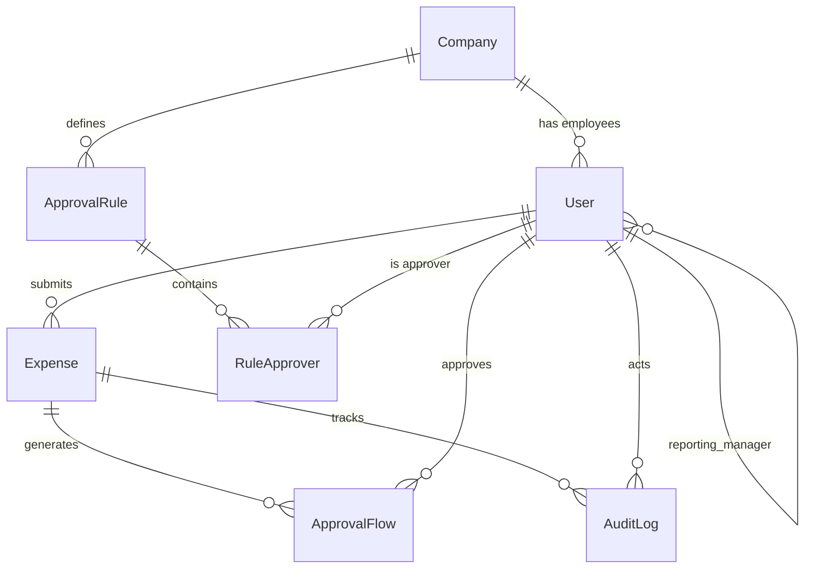

# FinTrack — Complete Backend Integration Guide

> **Smart Expense & Reimbursement Management System**
> Django 6.0 + Django REST Framework + MySQL + JWT + Tesseract OCR

---

## Table of Contents

1. [Architecture Overview](#1-architecture-overview)
2. [Tech Stack & Dependencies](#2-tech-stack--dependencies)
3. [Database Schema](#3-database-schema)
4. [API Reference](#4-api-reference)
5. [Authentication System](#5-authentication-system)
6. [Approval Workflow Engine](#6-approval-workflow-engine)
7. [OCR Receipt Scanner](#7-ocr-receipt-scanner)
8. [Analytics Engine](#8-analytics-engine)
9. [Role-Based Access Control (RBAC)](#9-role-based-access-control-rbac)
10. [Frontend ↔ Backend Wiring Map](#10-frontend--backend-wiring-map)
11. [Setup & Configuration](#11-setup--configuration)
12. [Email Configuration](#12-email-configuration)

---

## 1. Architecture Overview

```
┌─────────────────────────────────────────────────────────────────┐
│                   React + Vite (Frontend)                       │
│                   Port: 5173                                    │
│  ┌───────────┐ ┌───────────┐ ┌───────────┐ ┌───────────┐       │
│  │  Employee  │ │  Manager  │ │   Admin   │ │   Public  │       │
│  │ Dashboard  │ │ Dashboard │ │ Dashboard │ │  Home/Auth│       │
│  └─────┬─────┘ └─────┬─────┘ └─────┬─────┘ └─────┬─────┘       │
│        │              │              │              │            │
│        └──────────────┴──────────────┴──────────────┘            │
│                         │ Axios (JWT)                            │
│                         ▼                                        │
├─────────────────────────────────────────────────────────────────┤
│                Django REST Framework (Backend)                   │
│                Port: 8000  |  Prefix: /api/                     │
│  ┌──────────┐ ┌──────────┐ ┌──────────┐ ┌──────────┐           │
│  │ accounts │ │ expenses │ │approvals │ │analytics │           │
│  │ /api/auth│ │/api/exps │ │/api/appr │ │/api/anal │           │
│  └────┬─────┘ └────┬─────┘ └────┬─────┘ └────┬─────┘           │
│       │            │            │            │                  │
│       └────────────┴────────────┴────────────┘                  │
│                         │                                        │
│                         ▼                                        │
│              MySQL Database: fintrack_db                          │
│              (User, Company, Expense,                            │
│               ApprovalRule, ApprovalFlow,                         │
│               AuditLog, RuleApprover)                            │
└─────────────────────────────────────────────────────────────────┘
```

**Key architectural patterns:**
- **JWT Authentication** via `djangorestframework-simplejwt`
- **Custom Auth Backend** supporting login via email OR username
- **Role-based queryset filtering** — every view dynamically scopes data based on `request.user.role`
- **Auto-trigger workflow** — expense creation immediately routes through the approval pipeline

---

## 2. Tech Stack & Dependencies

| Layer | Technology | Purpose |
|-------|-----------|---------|
| **Backend Framework** | Django 6.0 | Core web framework |
| **API Layer** | Django REST Framework | RESTful API serialization |
| **Authentication** | `djangorestframework-simplejwt` | JWT token auth |
| **Database** | MySQL (`fintrack_db`) | Persistent data storage |
| **DB Driver** | `mysqlclient` | Python ↔ MySQL connector |
| **OCR Engine** | Tesseract (`pytesseract`) | Receipt text extraction |
| **Image Processing** | OpenCV (`opencv-python`) | Receipt image preprocessing |
| **PDF Parsing** | PyMuPDF (`fitz`) | Extract text from PDF receipts |
| **Image Handling** | Pillow | Receipt image I/O fallback |
| **HTTP Client** | `requests` | Country → Currency API lookup |
| **Frontend** | React 19 + Vite | SPA with Bootstrap 5 |
| **CORS** | `django-cors-headers` | Cross-origin resource sharing |

### `requirements.txt`

```
django>=6.0
djangorestframework
djangorestframework-simplejwt
django-cors-headers
mysqlclient
pytesseract
opencv-python
PyMuPDF
Pillow
requests
```

---

## 3. Database Schema

### Entity Relationship Diagram



### Models Detail

#### `accounts.Company`
| Field | Type | Description |
|-------|------|-------------|
| `id` | AutoField (PK) | Primary key |
| `name` | CharField(255, unique) | Company name |
| `base_currency` | CharField(10) | Default: `'USD'`. Auto-set from country on registration |
| `created_at` | DateTimeField | Auto-generated |

#### `accounts.User` (extends `AbstractUser`)
| Field | Type | Description |
|-------|------|-------------|
| `id` | AutoField (PK) | Primary key |
| `username` | CharField | Auto-generated from email prefix |
| `email` | EmailField | User email (used for login) |
| `password` | CharField | Hashed via `set_password()` |
| `first_name` | CharField | Display name |
| `role` | CharField(20) | `Admin` / `Manager` / `Employee` |
| `company` | ForeignKey → Company | The company the user belongs to |
| `reporting_manager` | ForeignKey → self | Direct line manager (nullable) |
| `employee_id` | CharField(50) | Optional employee identifier |
| `department` | CharField(100) | Optional department name |
| `email_verified` | BooleanField | Default: `False` |
| `email_verification_token` | UUIDField | Auto-generated token for email verify |
| `password_reset_token` | UUIDField | Nullable. Set on forgot-password request |
| `password_reset_expires` | DateTimeField | Nullable. 1 hour from token creation |

#### `expenses.Expense`
| Field | Type | Description |
|-------|------|-------------|
| `id` | AutoField (PK) | Primary key |
| `user` | ForeignKey → User | The submitter |
| `amount` | DecimalField(10,2) | Expense amount |
| `currency` | CharField(10) | Default: `'USD'` |
| `base_amount` | DecimalField(10,2) | Amount converted to company currency |
| `category` | CharField(100) | e.g. Travel, Food, Office Supplies |
| `description` | CharField(255) | Short description |
| `notes` | TextField | Optional detailed notes |
| `date` | DateField | Expense date |
| `receipt` | ImageField | Uploaded receipt file |
| `status` | CharField(20) | `Draft` / `Submitted` / `Pending` / `Approved` / `Rejected` |
| `vendor_name` | CharField(100) | Auto-filled by OCR |
| `created_at` | DateTimeField | Auto |
| `updated_at` | DateTimeField | Auto |

#### `approvals.ApprovalRule`
| Field | Type | Description |
|-------|------|-------------|
| `id` | AutoField (PK) | Primary key |
| `company` | ForeignKey → Company | Which company this rule applies to |
| `description` | CharField(255) | Human-readable rule name |
| `target_user` | ForeignKey → User (nullable) | Apply to specific user, or `null` for company-wide |
| `manager` | ForeignKey → User (nullable) | Override manager for this rule |
| `is_manager_approver` | BooleanField | If `True`, route to manager first |
| `approvers_sequence` | BooleanField | If `True`, approvers work sequentially |
| `min_approval_percentage` | IntegerField | Default: `100`. For parallel flows (e.g. 60%) |
| `created_at` | DateTimeField | Auto |

#### `approvals.RuleApprover`
| Field | Type | Description |
|-------|------|-------------|
| `id` | AutoField (PK) | Primary key |
| `rule` | ForeignKey → ApprovalRule | Parent rule |
| `user` | ForeignKey → User | The approving authority |
| `required` | BooleanField | If `True`, this approver has override power (CFO rule) |
| `sequence_order` | IntegerField | Ordering position in the sequence |

#### `approvals.ApprovalFlow`
| Field | Type | Description |
|-------|------|-------------|
| `id` | AutoField (PK) | Primary key |
| `expense` | ForeignKey → Expense | The expense being approved |
| `approver` | ForeignKey → User | Who needs to take action |
| `status` | CharField(20) | `Pending` / `Approved` / `Rejected` / `Draft` / `Closed/Skipped` |
| `step_order` | IntegerField | Sequence step number |
| `is_required` | BooleanField | Mandatory override approver flag |
| `comments` | TextField | Approver comments |
| `updated_at` | DateTimeField | Auto |

#### `approvals.AuditLog`
| Field | Type | Description |
|-------|------|-------------|
| `id` | AutoField (PK) | Primary key |
| `expense` | ForeignKey → Expense | Associated expense |
| `actor` | ForeignKey → User | Who performed the action |
| `action` | CharField(255) | `Approved` / `Rejected` |
| `timestamp` | DateTimeField | Auto |

---

## 4. API Reference

### Base URL: `http://localhost:8000/api/`

---

### 4.1 Authentication (`/api/auth/`)

| Method | Endpoint | Auth | Description |
|--------|----------|------|-------------|
| `POST` | `/auth/register/` | ❌ | Register new user with company |
| `POST` | `/auth/login/` | ❌ | JWT login (email or username) |
| `POST` | `/auth/token/refresh/` | ❌ | Refresh expired access token |
| `GET` | `/auth/users/me/` | ✅ | Get current authenticated user |
| `GET` | `/auth/users/` | ✅ Admin/Manager | List company users |
| `POST` | `/auth/users/` | ✅ Admin | Create new user |
| `GET/PUT/DELETE` | `/auth/users/{id}/` | ✅ Admin | Get/Update/Delete specific user |
| `POST` | `/auth/forgot-password/` | ❌ | Request password reset token |
| `POST` | `/auth/reset-password/` | ❌ | Reset password using token |
| `GET` | `/auth/verify-email/{token}/` | ❌ | Verify email address |
| `POST` | `/auth/resend-verification/` | ❌ | Resend verification email |

#### Register Request
```json
POST /api/auth/register/
{
    "email": "john@acme.com",
    "password": "SecurePass123",
    "first_name": "John",
    "role": "Employee",
    "company_name": "Acme Corp",
    "country": "India"
}
```

#### Login Request → Response
```json
POST /api/auth/login/
{ "username": "john@acme.com", "password": "SecurePass123" }

// Response:
{
    "access": "eyJhbGci...",
    "refresh": "eyJhbGci...",
    "user": {
        "id": 1,
        "username": "john",
        "email": "john@acme.com",
        "role": "Employee",
        "company": { "id": 1, "name": "Acme Corp", "base_currency": "INR" },
        "reporting_manager": 2,
        "email_verified": true
    }
}
```

#### Forgot Password Request
```json
POST /api/auth/forgot-password/
{ "email": "john@acme.com" }

// Response (Dev mode includes the link):
{
    "message": "Password reset link has been sent to your email.",
    "dev_token": "a3f4b2c1-...",
    "reset_link": "http://localhost:5173/reset-password/a3f4b2c1-..."
}
```

#### Reset Password Request
```json
POST /api/auth/reset-password/
{ "token": "a3f4b2c1-...", "password": "NewSecure456" }
```

---

### 4.2 Expenses (`/api/expenses/`)

| Method | Endpoint | Auth | Description |
|--------|----------|------|-------------|
| `GET` | `/expenses/` | ✅ | List expenses (role-scoped) |
| `POST` | `/expenses/` | ✅ | Create expense + auto-trigger workflow |
| `GET/PUT/DELETE` | `/expenses/{id}/` | ✅ | Get/Update/Delete specific expense |
| `POST` | `/expenses/ocr/` | ✅ | Upload receipt for OCR extraction |

#### Create Expense (triggers approval workflow automatically)
```json
POST /api/expenses/
Content-Type: multipart/form-data

{
    "description": "Client dinner at Hyatt",
    "category": "Food",
    "amount": "4500.00",
    "currency": "INR",
    "date": "2026-03-28",
    "notes": "Business development meeting",
    "receipt": <file>
}
```

**What happens on creation:**
1. Expense saved with `user = request.user`
2. `trigger_approval_workflow()` fires immediately
3. System checks for `ApprovalRule` (user-specific first, then company-wide)
4. If rule found → creates `ApprovalFlow` entries per rule config
5. If no rule → fallback hierarchy: `reporting_manager` → company `Admin` → auto-approve

#### Role-Based Query Scoping
| Role | What they see |
|------|---------------|
| **Admin** | All expenses in their company |
| **Manager** | Own expenses + direct reports' expenses |
| **Employee** | Only their own expenses |

#### OCR Upload
```json
POST /api/expenses/ocr/
Content-Type: multipart/form-data
{ "receipt": <file.jpg or file.pdf> }

// Response:
{
    "vendor": "Uber India",
    "amount": "1250.00",
    "date": "2026-03-24",
    "raw_text": "... full extracted text ..."
}
```

---

### 4.3 Approvals (`/api/approvals/`)

| Method | Endpoint | Auth | Description |
|--------|----------|------|-------------|
| `GET` | `/approvals/rules/` | ✅ Admin | List all approval rules |
| `POST` | `/approvals/rules/` | ✅ Admin | Create new rule with nested approvers |
| `GET` | `/approvals/pending/` | ✅ Admin/Manager | List pending approval flows |
| `GET` | `/approvals/manager-pending/` | ✅ Admin/Manager | Alias for pending (frontend uses this) |
| `POST` | `/approvals/{flow_id}/action/` | ✅ | Approve or Reject a flow |
| `GET` | `/approvals/audit-log/` | ✅ | List audit trail (role-scoped) |

#### Create Approval Rule (with nested approvers)
```json
POST /api/approvals/rules/
{
    "description": "Standard expense approval with CFO override",
    "target_user": null,
    "manager": 2,
    "is_manager_approver": true,
    "approvers_sequence": true,
    "min_approval_percentage": 60,
    "approvers": [
        { "user": 3, "required": true, "sequence_order": 1 },
        { "user": 4, "required": false, "sequence_order": 2 },
        { "user": 5, "required": false, "sequence_order": 3 }
    ]
}
```

#### Approve/Reject Action
```json
POST /api/approvals/7/action/
{
    "status": "Approved",
    "comments": "Looks good, approved for reimbursement."
}
```

**Approval Engine Logic:**

```
┌──────────────────────────────┐
│     Action received          │
│   (Approve or Reject)        │
└─────────────┬────────────────┘
              │
              ▼
    ┌─────────────────┐     YES    ┌──────────────────┐
    │ Is this approver├───────────►│ AUTO-APPROVE full │
    │ marked Required?│            │ expense. Close all│
    └────────┬────────┘            │ other flows.      │
             │ NO                  └──────────────────┘
             ▼
    ┌─────────────────────────┐
    │ Calculate % approved at │
    │ current step:           │
    │ (approved / total) * 100│
    └────────┬────────────────┘
             │
             ▼
    ┌──────────────────────────┐
    │ % >= min_approval_%  ?   │
    └────┬────────────┬────────┘
     YES │            │ NO
         ▼            ▼
  ┌──────────┐  ┌────────────────┐
  │ Next step│  │ Wait for more  │
  │ exists?  │  │ approvals      │
  └──┬───┬───┘  └────────────────┘
 YES │   │ NO
     ▼   ▼
┌────────┐ ┌─────────────────┐
│Activate│ │ APPROVE expense │
│next    │ │ Close remaining │
│step    │ └─────────────────┘
└────────┘
```

---

### 4.4 Analytics (`/api/analytics/`)

| Method | Endpoint | Auth | Description |
|--------|----------|------|-------------|
| `GET` | `/analytics/` | ✅ | Dashboard stats (role-scoped) |

#### Response
```json
{
    "total_expenses": 52400.00,
    "total_pending": 8500.00,
    "category_breakdown": [
        { "category": "Travel", "total": 25000.00 },
        { "category": "Food", "total": 15000.00 },
        { "category": "Office", "total": 12400.00 }
    ],
    "user_totals": [
        { "user__username": "john", "total": 18000.00 },
        { "user__username": "jane", "total": 34400.00 }
    ]
}
```

---

## 5. Authentication System

### 5.1 Custom Auth Backend

**File:** `accounts/backends.py`

Allows login using either `username` OR `email`:

```python
class EmailOrUsernameModelBackend(ModelBackend):
    def authenticate(self, request, username=None, password=None, **kwargs):
        user = UserModel.objects.filter(
            Q(username__iexact=username) | Q(email__iexact=username)
        ).distinct().first()
        if user and user.check_password(password):
            return user
```

### 5.2 JWT Token Lifecycle

```
┌───────────┐   POST /auth/login/     ┌─────────────┐
│  Frontend │ ─────────────────────►   │   Backend   │
│  (React)  │   {email, password}      │  (Django)   │
└───────────┘                          └──────┬──────┘
     ▲                                        │
     │   {access, refresh, user}              │
     └────────────────────────────────────────┘

Access Token Lifetime:  1 day
Refresh Token Lifetime: 7 days

Every API call includes:
  Authorization: Bearer <access_token>
```

### 5.3 Registration Flow

```
User fills form → POST /auth/register/
  ├─ Auto-generate username from email prefix
  ├─ Get/Create Company by company_name
  ├─ Lookup currency via REST Countries API
  ├─ Set user role (Admin/Manager/Employee)
  └─ Return created user
```

### 5.4 Password Reset Flow

```
1. User clicks "Forgot Password" → lands on /forgot-password
2. Frontend POST /auth/forgot-password/ {email}
3. Backend generates UUID token, stores on User, sets 1hr expiry
4. Backend sends email with reset link (dev: prints to console)
5. User clicks link → /reset-password/:token
6. Frontend POST /auth/reset-password/ {token, password}
7. Backend validates token + expiry → sets new password
8. User redirected to /login
```

### 5.5 Email Verification Flow

```
1. On registration, User.email_verification_token = uuid4()
2. Backend can send email with /verify-email/{token}/ link
3. GET /auth/verify-email/{token}/ → sets email_verified = True
4. Resend via POST /auth/resend-verification/ {email}
```

---

## 6. Approval Workflow Engine

### 6.1 Trigger Mechanism

**File:** `expenses/views.py` → `ExpenseListCreateView.perform_create()`

Every expense creation **immediately** triggers `trigger_approval_workflow()`. There is NO "Draft" parking — expenses enter the pipeline instantly.

### 6.2 Routing Priority

```
1. Check for ApprovalRule targeting this specific user
2. If not found → Check for company-wide ApprovalRule
3. If rule exists:
   a. If is_manager_approver → Create flow for manager (Step 1)
   b. Create flows for each RuleApprover in sequence
   c. Set expense status = 'Pending'
4. If NO rule exists (Default Fallback):
   a. user.reporting_manager exists? → Route to manager
   b. No manager + user is not Admin? → Find company Admin → Route there
   c. User IS Admin? → Auto-approve
```

### 6.3 Approval Business Rules

| Rule | Behavior |
|------|----------|
| **Required Approver Override** | If approver has `is_required=True` and clicks Approve → expense auto-approved, all other flows closed |
| **Percentage Threshold** | In parallel mode, calculates `(approved_count / total_count) * 100`. If `>= min_approval_percentage` → step passes |
| **Sequential Flow** | When `approvers_sequence=True`, each step must pass before next step activates (Draft → Pending) |
| **Parallel Flow** | When `approvers_sequence=False`, all approvers at the same step receive requests simultaneously |
| **Required Rejection** | If ANY `is_required` approver rejects → expense auto-rejected, all flows closed |
| **Hybrid** | Both percentage AND required approver can coexist. Whichever condition is met first wins |

### 6.4 Status State Machine

```
Expense Statuses:    Draft → Pending → Approved / Rejected
Flow Statuses:       Draft → Pending → Approved / Rejected / Closed/Skipped
```

---

## 7. OCR Receipt Scanner

**File:** `expenses/ocr_service.py`

### Pipeline

```
Upload Receipt
      │
      ▼
┌─────────────────┐
│ Is PDF?          │──YES──► PyMuPDF text extraction
│                  │         │
│                  │         ▼
│                  │    Text layer empty?
│                  │    │ YES → Rasterize page at 300 DPI
│                  │    │        → Run Tesseract on image
│                  │    │ NO  → Use extracted text
└────────┬────────┘
         │ NO (Image)
         ▼
┌─────────────────┐
│ OpenCV preproc   │
│ • Grayscale      │
│ • Thresholding   │
│ → Tesseract OCR  │
└────────┬────────┘
         │
         ▼
┌─────────────────┐
│ Regex Parsing    │
│ • Vendor: first  │
│   non-numeric ln │
│ • Amount: largest│
│   currency match │
│ • Date: first    │
│   date pattern   │
└─────────────────┘
```

### Supported Formats
- JPEG, PNG, BMP, TIFF (image)
- PDF (text-layer or scanned)

### System Requirement
- **Tesseract-OCR** must be installed on the host machine
- Default path: `C:\Program Files\Tesseract-OCR\tesseract.exe`

---

## 8. Analytics Engine

**File:** `analytics/views.py`

The analytics endpoint computes aggregates dynamically from the `Expense` table using Django ORM:

```python
category_breakdown = qs.values('category').annotate(total=Sum('amount'))
user_totals = qs.values('user__username').annotate(total=Sum('amount'))
total_amount = qs.aggregate(Sum('amount'))['amount__sum']
total_pending = qs.filter(status='Pending').aggregate(Sum('amount'))['amount__sum']
```

All queries are **role-scoped** using the same pattern as other views.

---

## 9. Role-Based Access Control (RBAC)

### Permission Matrix

| Feature | Employee | Manager | Admin |
|---------|----------|---------|-------|
| View own expenses | ✅ | ✅ | ✅ |
| Submit expenses | ✅ | ✅ | ✅ |
| View team expenses | ❌ | ✅ (direct reports) | ✅ (all company) |
| Approve/Reject | ❌ | ✅ (assigned flows) | ✅ (all company flows) |
| Override approvals | ❌ | ❌ | ✅ |
| Manage users | ❌ | ❌ | ✅ |
| Configure rules | ❌ | ❌ | ✅ |
| View analytics | ❌ | ✅ (team) | ✅ (company) |
| Delete expenses | ✅ (own) | ✅ (own + team) | ✅ (all company) |

### How Scoping Works

Every `get_queryset()` in every view follows the same pattern:

```python
def get_queryset(self):
    user = self.request.user
    if user.role == 'Admin':
        return Model.objects.filter(user__company=user.company)
    elif user.role == 'Manager':
        return Model.objects.filter(user=user) | Model.objects.filter(user__reporting_manager=user)
    return Model.objects.filter(user=user)
```

---

## 10. Frontend ↔ Backend Wiring Map

### Page → API Endpoint Mapping

| Frontend Page | Component | API Endpoint(s) | Method |
|---------------|-----------|------------------|--------|
| Login | `Login.jsx` | `/auth/login/` | POST |
| Register | `Register.jsx` | `/auth/register/` | POST |
| Forgot Password | `ForgotPassword.jsx` | `/auth/forgot-password/` | POST |
| Reset Password | `ResetPassword.jsx` | `/auth/reset-password/` | POST |
| Verify Email | `VerifyEmail.jsx` | `/auth/verify-email/{token}/` | GET |
| Admin Dashboard | `AdminDashboard.jsx` | `/expenses/`, `/auth/users/`, `/approvals/audit-log/` | GET |
| Manager Dashboard | `ManagerDashboard.jsx` | `/expenses/`, `/approvals/manager-pending/` | GET |
| Employee Dashboard | `EmployeeDashboard.jsx` | `/expenses/` | GET |
| All Expenses | `ExpenseList.jsx` | `/expenses/`, `/expenses/{id}/` | GET, DELETE |
| Add Expense | `ExpenseForm.jsx` | `/expenses/`, `/expenses/ocr/` | POST |
| Approval Hub | `Approvals.jsx` | `/approvals/manager-pending/`, `/approvals/{id}/action/` | GET, POST |
| Approval Rules | `ApprovalRules.jsx` | `/approvals/rules/`, `/auth/users/` | GET, POST |
| User Management | `UserManagement.jsx` | `/auth/users/`, `/auth/users/{id}/` | GET, PUT, DELETE |
| Analytics | `Analytics.jsx` | `/analytics/` | GET |

### Axios Configuration

**File:** `frontend/src/api/axios.js`

```javascript
baseURL: 'http://localhost:8000/api/'
headers: { Authorization: `Bearer ${localStorage.getItem('access_token')}` }
```

### Route Configuration

**File:** `frontend/src/App.jsx`

| Path | Component | Access |
|------|-----------|--------|
| `/` | Home / Redirect | Public |
| `/login` | Login | Public |
| `/register` | Register | Public |
| `/forgot-password` | ForgotPassword | Public |
| `/reset-password/:token` | ResetPassword | Public |
| `/verify-email/:token` | VerifyEmail | Public |
| `/admin` | AdminDashboard | Admin only |
| `/manager` | ManagerDashboard | Manager only |
| `/employee` | EmployeeDashboard | Employee only |
| `/expenses` | ExpenseList | All authenticated |
| `/expenses/new` | ExpenseForm | All authenticated |
| `/approvals` | Approvals | Manager + Admin |
| `/analytics` | Analytics | Manager + Admin |
| `/admin/users` | UserManagement | Admin only |
| `/admin/rules` | ApprovalRules | Admin only |

---

## 11. Setup & Configuration

### Prerequisites
- Python 3.10+
- Node.js 18+
- MySQL 8.0+
- Tesseract-OCR installed (`C:\Program Files\Tesseract-OCR\tesseract.exe`)

### Backend Setup

```bash
# 1. Navigate to project
cd FinTrack/backend

# 2. Create virtual environment
python -m venv venv
venv\Scripts\activate        # Windows
source venv/bin/activate     # macOS/Linux

# 3. Install dependencies
pip install -r requirements.txt

# 4. Create MySQL database
mysql -u root -p -e "CREATE DATABASE fintrack_db;"

# 5. Run migrations
python manage.py makemigrations accounts expenses approvals analytics
python manage.py migrate

# 6. Create superuser
python manage.py createsuperuser

# 7. Start server
python manage.py runserver
```

### Frontend Setup

```bash
cd FinTrack/frontend

npm install
npm run dev
```

### Database Configuration

**File:** `backend/settings.py`

```python
DATABASES = {
    'default': {
        'ENGINE': 'django.db.backends.mysql',
        'NAME': 'fintrack_db',
        'USER': 'root',
        'PASSWORD': '1234',
        'HOST': 'localhost',
        'PORT': '3306',
    }
}
```

---

## 12. Email Configuration

**File:** `backend/settings.py`

### Development Mode (Current)

```python
EMAIL_BACKEND = 'django.core.mail.backends.console.EmailBackend'
# Emails print to Django terminal output
```

### Production Mode (Gmail SMTP Example)

```python
EMAIL_BACKEND = 'django.core.mail.backends.smtp.EmailBackend'
EMAIL_HOST = 'smtp.gmail.com'
EMAIL_PORT = 587
EMAIL_USE_TLS = True
EMAIL_HOST_USER = 'your@gmail.com'
EMAIL_HOST_PASSWORD = 'your_app_password'  # Use App Password, not your real password
DEFAULT_FROM_EMAIL = 'FinTrack <noreply@fintrack.app>'
```

### Production Mode (SendGrid Example)

```python
EMAIL_BACKEND = 'django.core.mail.backends.smtp.EmailBackend'
EMAIL_HOST = 'smtp.sendgrid.net'
EMAIL_PORT = 587
EMAIL_USE_TLS = True
EMAIL_HOST_USER = 'apikey'
EMAIL_HOST_PASSWORD = 'SG.your_sendgrid_api_key'
DEFAULT_FROM_EMAIL = 'FinTrack <noreply@fintrack.app>'
```

---

## File Structure

```
FinTrack/
├── backend/
│   ├── manage.py
│   ├── backend/
│   │   ├── settings.py          # Django config, DB, JWT, Email, CORS
│   │   ├── urls.py              # Root URL router → /api/auth/, /api/expenses/, etc.
│   │   └── wsgi.py
│   ├── accounts/
│   │   ├── models.py            # User, Company models
│   │   ├── serializers.py       # RegisterSerializer, UserSerializer, JWT
│   │   ├── views.py             # Auth views, Password Reset, Email Verify
│   │   ├── urls.py              # Auth endpoint registration
│   │   ├── backends.py          # EmailOrUsernameModelBackend
│   │   └── utils.py             # get_currency_for_country()
│   ├── expenses/
│   │   ├── models.py            # Expense model
│   │   ├── serializers.py       # ExpenseSerializer, ReceiptUploadSerializer
│   │   ├── views.py             # CRUD + auto workflow trigger + OCR
│   │   ├── urls.py              # Expense endpoints
│   │   └── ocr_service.py       # Tesseract + OpenCV + PyMuPDF pipeline
│   ├── approvals/
│   │   ├── models.py            # ApprovalRule, RuleApprover, ApprovalFlow, AuditLog
│   │   ├── serializers.py       # Nested writable serializers
│   │   ├── views.py             # Rules CRUD, Pending list, Action engine, Audit log
│   │   └── urls.py              # Approval endpoints
│   └── analytics/
│       ├── views.py             # Aggregation dashboard
│       └── urls.py
│
├── frontend/
│   ├── src/
│   │   ├── App.jsx              # Route definitions
│   │   ├── index.css            # Global design system
│   │   ├── api/axios.js         # Axios instance with JWT interceptor
│   │   ├── context/AuthContext.jsx  # Auth state management
│   │   ├── components/
│   │   │   ├── Layout.jsx       # Dashboard shell (sidebar + top bar)
│   │   │   ├── Sidebar.jsx      # Role-aware navigation
│   │   │   └── PrivateRoute.jsx # Route guard with role check
│   │   └── pages/
│   │       ├── Home.jsx              # Landing page
│   │       ├── Login.jsx             # JWT login with role tabs
│   │       ├── Register.jsx          # Registration with role + company
│   │       ├── ForgotPassword.jsx    # Email-based reset request
│   │       ├── ResetPassword.jsx     # Token-based password reset
│   │       ├── VerifyEmail.jsx       # Email verification handler
│   │       ├── AdminDashboard.jsx    # KPIs + expense table + audit trail
│   │       ├── ManagerDashboard.jsx  # Team activity + approval count
│   │       ├── EmployeeDashboard.jsx # Personal stats + recent submissions
│   │       ├── ExpenseList.jsx       # Full expense table with delete
│   │       ├── ExpenseForm.jsx       # Create expense + OCR upload
│   │       ├── Approvals.jsx         # Approval hub with comment modal
│   │       ├── ApprovalRules.jsx     # Dynamic rule builder
│   │       ├── UserManagement.jsx    # Admin user CRUD
│   │       └── Analytics.jsx         # Chart.js pie + bar charts
│   └── public/
│       ├── logo-light.png
│       └── logo-dark.png
```

---

> **Document Version:** 1.0 — Generated for FinTrack on 2026-03-29
