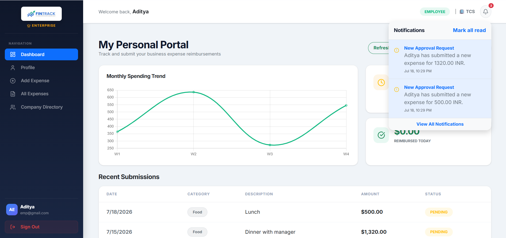
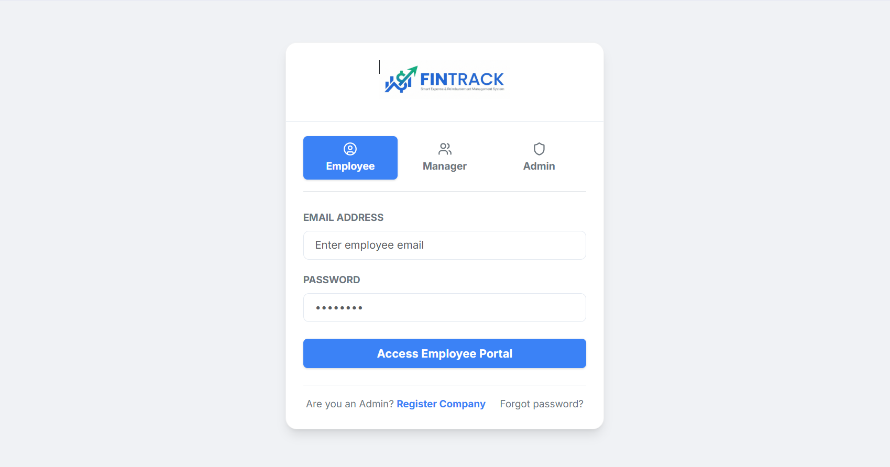
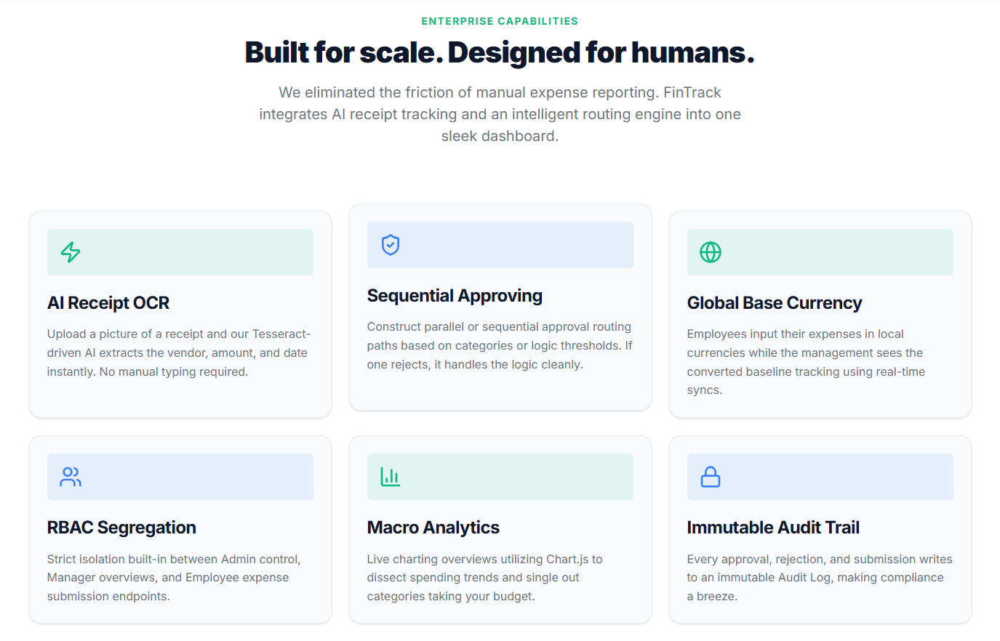
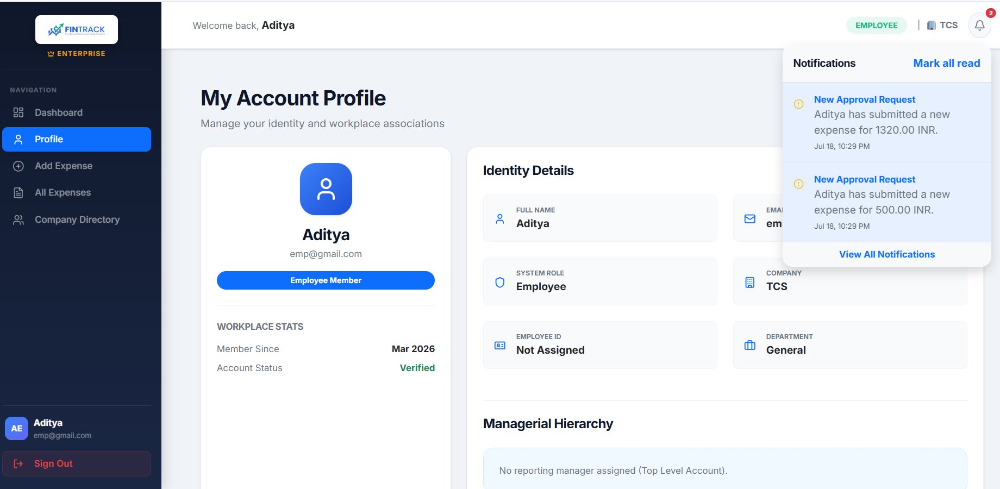

<div align="center">

# 💰 FinTrack

### AI-Powered Personal Finance Management Platform

Track • Budget • Save • Grow 🚀


---

### 💡 Smart Finance. Better Decisions.

</div>

---

# 📖 About

**FinTrack** is an AI-powered Personal Finance Management Platform that helps users efficiently manage their finances through intelligent expense tracking, budget planning, savings management, and real-time financial analytics.

The platform combines modern web technologies with AI-powered insights to simplify financial planning, encourage better spending habits, and provide users with a comprehensive view of their financial health through interactive dashboards and reports.

---

# ✨ Key Features

### 👤 Authentication

- Secure Login & Registration
- JWT Authentication
- Password Reset
- User Profile

### 💰 Finance Management

- Add Income
- Add Expenses
- Multiple Categories
- Budget Planning
- Savings Goals
- Transaction History

### 📊 Dashboard

- Real-Time Analytics
- Monthly Reports
- Spending Trends
- Income vs Expense Graph
- Pie Charts
- Line Charts
- Financial Summary Cards

### 🤖 AI Features

- Smart Expense Categorization
- Spending Pattern Analysis
- Budget Recommendations
- Expense Prediction
- Personalized Financial Insights

### 🔔 Smart Features

- Budget Limit Alerts
- Bill Payment Reminders
- Monthly Financial Reports
- Goal Tracking
- Email Notifications

### 📱 User Experience

- Responsive Design
- Dark Mode
- Mobile Friendly
- Fast Performance
- Beautiful UI

---

# 🛠 Tech Stack

## Frontend

- React.js
- JavaScript
- HTML5
- CSS3
- Tailwind CSS
- Axios
- Chart.js

---

## Backend

- Django
- Django REST Framework
- REST APIs
- JWT Authentication

---

## Database

- MySQL

---

## AI & Analytics

- Python
- Pandas
- NumPy
- Scikit-learn
- Matplotlib

---

## Tools

- Git
- GitHub
- VS Code
- Postman
- Figma

---

# 🏗 System Architecture

```
               User
                 │
                 ▼
          React Frontend
                 │
        REST API Requests
                 │
                 ▼
        Django REST Backend
                 │
      ┌──────────┼──────────┐
      ▼          ▼          ▼
 Authentication Database AI Engine
      │          │          │
      └──────────┼──────────┘
                 ▼
              MySQL
```

---

# 📂 Project Structure

```
FinTrack
│
├── backend
│   ├── api
│   ├── users
│   ├── finance
│   ├── analytics
│   ├── ai
│   ├── manage.py
│   └── requirements.txt
│
├── frontend
│   ├── public
│   ├── src
│   │   ├── components
│   │   ├── pages
│   │   ├── services
│   │   ├── context
│   │   └── assets
│   └── package.json
│
├── screenshots
├── README.md
└── .gitignore
```

---

# 📸 Screenshots

<div align="center">

## 🏠 Dashboard



</div>

---

<div align="center">

## 🔐 Login Page



</div>

---

<div align="center">

## ✨ Features Overview



</div>

---

<div align="center">

## 👤 User Profile



</div>

---

# 🚀 Installation

## Clone Repository

```bash
git clone https://github.com/AdityaGade28/FinTrack.git
```

Backend

```bash
cd backend

python -m venv venv

venv\Scripts\activate

pip install -r requirements.txt

python manage.py migrate

python manage.py runserver
```

Frontend

```bash
cd frontend

npm install

npm run dev
```

---

# 📊 Future Enhancements

- AI Financial Assistant
- Voice-Based Expense Entry
- OCR Receipt Scanner
- UPI Integration
- Razorpay Integration
- Bank API Integration
- Investment Portfolio
- Credit Score Prediction
- Tax Calculator
- Expense Forecasting
- Multi-Currency Support
- Family Budget Sharing
- Cloud Deployment
- Android & iOS Application

---

# 🎯 Project Objectives

- Simplify personal finance management
- Improve budgeting habits
- Track income and expenses efficiently
- Generate insightful financial reports
- Encourage better saving practices
- Provide AI-powered financial recommendations

---

# 📈 Workflow

```
Register/Login
       │
       ▼
Dashboard
       │
       ▼
Add Income / Expense
       │
       ▼
Store in Database
       │
       ▼
Generate Reports
       │
       ▼
AI Analysis
       │
       ▼
Financial Insights
```

---


---

# 🌟 Repository Stats

⭐ Star this repository if you like the project.

🍴 Fork it to contribute.

🐛 Report Issues

💡 Suggest New Features

---

# 📜 License

This project is developed for educational and academic purposes as a Final Year Engineering Project.

---

<div align="center">

## ⭐ If you found this project helpful, don't forget to Star the Repository ⭐

Made with ❤️ by **Team FinTrack**

</div>

